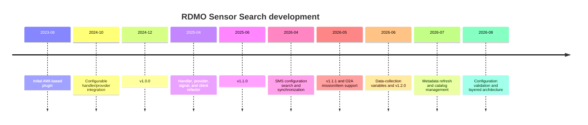

<!--
SPDX-FileCopyrightText: 2026 RDMO Community and individual contributors
SPDX-License-Identifier: Apache-2.0
-->

# Development history

[Documentation index](index.md) · [Developer architecture](developer-architecture.md) · [Commit inventory](#commit-inventory)

RDMO Sensor Search grew from a small sensor-registry option-set plugin into a
configuration-driven integration layer for search, metadata enrichment, and
RDMO synchronization. This is a curated account of that evolution. It favors
the decisions and capabilities that changed how the plugin is used or
maintained; the [commit inventory](#commit-inventory) provides the complete
Git evidence.



## 1. Foundation: from AWI-derived search to v1.0.0

**August 2023 – December 2024 · [v1.0.0](https://gitlab.ulb.tu-darmstadt.de/rdmo/plugins/rdmo-plugins-sensorsearch/-/tags/1.0.0)**

The project started from the AWI sensor plugin, retaining RDMO option-set
integration while introducing support for the GIPP, O2A Registry, and Sensor
Management System (SMS) backends. The initial implementation already combined
search with metadata transfer into RDMO answers.

The defining design choice during this phase was to make registry integrations
configuration-driven rather than hard-code a single backend. The October
refactor introduced the handler/provider configuration shape that let one
deployment use multiple registry instances, especially the separate productive
SMS installations. The late-2024 work then made the integration practical in
real catalogs: it added collection handling, contact metadata, catalog
examples, request identification, configuration caching, and more useful error
messages.

Representative evidence:

- [Initial AWI-derived implementation](https://gitlab.ulb.tu-darmstadt.de/rdmo/plugins/rdmo-plugins-sensorsearch/-/commit/4f23517)
- [Handler/provider configuration refactor](https://gitlab.ulb.tu-darmstadt.de/rdmo/plugins/rdmo-plugins-sensorsearch/-/commit/46659e2)
- [Collection value handling and diagnostic improvements](https://gitlab.ulb.tu-darmstadt.de/rdmo/plugins/rdmo-plugins-sensorsearch/-/commit/18529f9) and [contact metadata enrichment](https://gitlab.ulb.tu-darmstadt.de/rdmo/plugins/rdmo-plugins-sensorsearch/-/commit/81b8d8f)
- [First major release](https://gitlab.ulb.tu-darmstadt.de/rdmo/plugins/rdmo-plugins-sensorsearch/-/commit/6cdd82b)

## 2. A maintainable integration architecture

**April – June 2025 · [v1.1.0](https://gitlab.ulb.tu-darmstadt.de/rdmo/plugins/rdmo-plugins-sensorsearch/-/tags/1.1.0)**

As the number of backends and mappings grew, the original flat modules became
harder to extend safely. A coordinated refactor split handler adapters,
providers, signal handling, configuration, and HTTP client responsibilities
into separate packages. This was an internal restructuring: the plugin kept
its registry-facing behavior while gaining clearer seams for adding or changing
an integration.

The period also improved resilience and responsiveness. Provider calls could
run concurrently, the O2A provider was simplified, and client/signal error
handling was tightened. These changes established the extension structure used
by later synchronization work.

Representative evidence:

- [Split handlers into a package](https://gitlab.ulb.tu-darmstadt.de/rdmo/plugins/rdmo-plugins-sensorsearch/-/commit/5ee5f5d), [providers](https://gitlab.ulb.tu-darmstadt.de/rdmo/plugins/rdmo-plugins-sensorsearch/-/commit/3e1484e), [signals](https://gitlab.ulb.tu-darmstadt.de/rdmo/plugins/rdmo-plugins-sensorsearch/-/commit/ad766fe), and [configuration/client](https://gitlab.ulb.tu-darmstadt.de/rdmo/plugins/rdmo-plugins-sensorsearch/-/commit/d6898f2)
- [Concurrent option lookup](https://gitlab.ulb.tu-darmstadt.de/rdmo/plugins/rdmo-plugins-sensorsearch/-/commit/f82a101)
- [v1.1.0 release](https://gitlab.ulb.tu-darmstadt.de/rdmo/plugins/rdmo-plugins-sensorsearch/-/commit/84358bd)

## 3. Configuration-aware SMS synchronization

**April – May 2026 · [v1.1.1](https://gitlab.ulb.tu-darmstadt.de/rdmo/plugins/rdmo-plugins-sensorsearch/-/tags/1.1.1)**

This was the largest functional expansion. The plugin moved beyond selecting a
standalone device: users could search SMS configurations, materialize their
member devices in RDMO collections, and keep device details synchronized with
the selected configuration. Attribute mappings gained support for dates,
locations, links, and question-set targets, while date handling became
timezone-aware.

The important design decision was to preserve the catalog URI contract while
adding synchronization behavior around it. Configuration and device identifiers
were mapped into collection blocks instead of replacing catalog structure, so
the Earth Sensor catalog could gain richer behavior without an incompatible
URI migration. The work also made destructive updates safer by clearing values
only after a successful backend fetch and by fixing delete synchronization.

The phase broadened the O2A integration from registry records to missions and
items, letting the same search-and-sync pattern serve another research
workflow.

Representative evidence:

- [SMS configuration search](https://gitlab.ulb.tu-darmstadt.de/rdmo/plugins/rdmo-plugins-sensorsearch/-/commit/942b284)
- [Configuration-to-device collection synchronization](https://gitlab.ulb.tu-darmstadt.de/rdmo/plugins/rdmo-plugins-sensorsearch/-/commit/fcafd8c)
- [Successful-fetch protection](https://gitlab.ulb.tu-darmstadt.de/rdmo/plugins/rdmo-plugins-sensorsearch/-/commit/2b469cc) and [device-delete synchronization fix](https://gitlab.ulb.tu-darmstadt.de/rdmo/plugins/rdmo-plugins-sensorsearch/-/commit/0b68dab)
- [O2A missions and items](https://gitlab.ulb.tu-darmstadt.de/rdmo/plugins/rdmo-plugins-sensorsearch/-/commit/d9790cd)
- [v1.1.1 release](https://gitlab.ulb.tu-darmstadt.de/rdmo/plugins/rdmo-plugins-sensorsearch/-/tags/1.1.1)

## 4. From selected devices to data-collection variables

**May – June 2026 · [v1.2.0](https://gitlab.ulb.tu-darmstadt.de/rdmo/plugins/rdmo-plugins-sensorsearch/-/tags/1.2.0)**

Selection was extended into downstream data-collection planning. A
project-local provider made selected devices reusable in data-collection
questions; synchronization then derived parameter and variable rows from their
metadata. This connected registry details to the practical description of how
data will be collected, instead of limiting the plugin to discovery alone.

The accompanying move to Hatch/Hatch-VCS made version and package metadata
release-oriented, leading to the v1.2.0 release.

Representative evidence:

- [Project-local data-collection device provider](https://gitlab.ulb.tu-darmstadt.de/rdmo/plugins/rdmo-plugins-sensorsearch/-/commit/83335b4)
- [Data-collection parameter and variable synchronization](https://gitlab.ulb.tu-darmstadt.de/rdmo/plugins/rdmo-plugins-sensorsearch/-/commit/2fb667a)
- [Release packaging/versioning change](https://gitlab.ulb.tu-darmstadt.de/rdmo/plugins/rdmo-plugins-sensorsearch/-/commit/0e5a79a)

## 5. Controlled refresh and catalog-aware workflows

**July 2026**

This phase made synchronization more controllable from the interview. Search
requests could pass the logged-in user's authentication token where supported,
and catalog editors could add refresh triggers to refetch metadata on demand.
The plugin gained configuration/device management, refresh status feedback,
support for multiple catalog URIs, and collection-layout-aware cleanup.

The design moved refresh from an implicit side effect to an explicit catalog
workflow: catalog attributes configure the trigger and feedback fields, while
the plugin performs the backend work and reconciliation. This gives editors
control over where and when a refresh is available without embedding
catalog-specific paths in Python code.

Representative evidence:

- [Authentication token support for search](https://gitlab.ulb.tu-darmstadt.de/rdmo/plugins/rdmo-plugins-sensorsearch/-/commit/c6b5df1)
- [Initial device refresh workflow](https://gitlab.ulb.tu-darmstadt.de/rdmo/plugins/rdmo-plugins-sensorsearch/-/commit/5a6e66b)
- [Metadata refresh and configuration/device management](https://gitlab.ulb.tu-darmstadt.de/rdmo/plugins/rdmo-plugins-sensorsearch/-/commit/dcc1e19)
- [Collection-layout cleanup](https://gitlab.ulb.tu-darmstadt.de/rdmo/plugins/rdmo-plugins-sensorsearch/-/commit/6ae957b)

## 6. Reliability hardening and explicit boundaries

**August 2026**

The rapid synchronization expansion was consolidated into the architecture
described in the [developer architecture](developer-architecture.md).
`sensorsearch.toml` became a validated model with cross-reference checks and
clear initialization errors. Device-detail work was separated into domain
services, workflow orchestration, and persistence adapters; signal receivers
became narrow adapters that schedule work after commits.

This separation is the key maintainability decision in the current design.
Pure planning and selection logic is testable without Django, persistence owns
RDMO writes, and backend-specific SMS enrichment is injected rather than
coupled into generic synchronization. Subsequent fixes clarified static
location tolerance, incomplete mount-chain behavior, optional membership
filtering, and recursive value-signal handling, with matching documentation
and test/catalog fixtures.

Representative evidence:

- [Validated TOML configuration model](https://gitlab.ulb.tu-darmstadt.de/rdmo/plugins/rdmo-plugins-sensorsearch/-/commit/46ef661)
- [Device-detail service extraction](https://gitlab.ulb.tu-darmstadt.de/rdmo/plugins/rdmo-plugins-sensorsearch/-/commit/fa99bd6) and [workflow extraction](https://gitlab.ulb.tu-darmstadt.de/rdmo/plugins/rdmo-plugins-sensorsearch/-/commit/6682545)
- [Configuration-period and membership policy](https://gitlab.ulb.tu-darmstadt.de/rdmo/plugins/rdmo-plugins-sensorsearch/-/commit/1dcc8c6)
- [Consolidated value-event handling, tests, and documentation](https://gitlab.ulb.tu-darmstadt.de/rdmo/plugins/rdmo-plugins-sensorsearch/-/commit/472ef27)

## Architecture evolution

| Period | Structure | Why it mattered |
| --- | --- | --- |
| 2023–2024 | Providers and handlers directly combined search, backend interpretation, and RDMO updates. | Delivered multi-registry search quickly. |
| 2025 | Dedicated handler, provider, signal, configuration, and client packages. | Made integrations and runtime behavior easier to extend. |
| 2026 | Validated configuration models; backend-neutral services; workflows; persistence adapters; thin signal receivers. | Makes synchronization rules testable, isolates RDMO writes, and protects catalog URI compatibility. |

## Commit inventory

The complete chronological inventory is generated from the local Git history;
it is intentionally separate from this curated narrative. Run this from the
repository root to produce a Markdown table with every commit, its changed
paths, and a mechanical first-pass category:

```bash
testing/tools/generate_development_commit_inventory.sh > development-commit-inventory.md
```

The generated category is an aid for review, not an assertion about intent.
When adding a future milestone, use the inventory to find candidates, inspect
the diff, and link only the representative commits that substantiate the
story.
